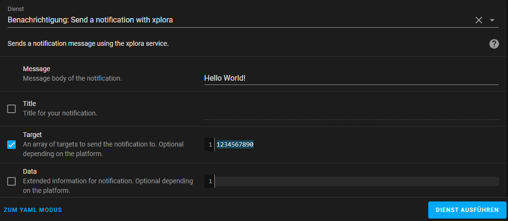

# Xplora® Watch

Home Assistant Sensors for Xplora® Watch

[](https://github.com/hacs/integration)
[](https://github.com/Ludy87/xplora_watch/releases)

[](LICENSE)
[](https://github.com/Ludy87/xplora_watch/issues)
[](https://github.com/psf/black)

[](https://github.com/Ludy87/xplora_watch/actions/workflows/hassfest.yaml)


## Features

Features | Type
---|---
Battery | Sensor
Watch-Xcoin | Sensor
Watch Step per Day | Sensor
Watch Online state | Binary Sensor
Watch is safe | Binary Sensor
Watch charging | Binary Sensor
Watch silent(s) | Switch
Watch alarm(s) | Switch
Send Message | Notify
Watch Tracking | Device Tracker
Watch Show Safezone | Device Tracker

---
## Installation

### MANUAL INSTALLATION

Copy the xplora_watch [last Releae](https://github.com/Ludy87/xplora_watch/releases) folder and all of its contents into your Home Assistant's custom_components folder. This folder is usually inside your /config folder. If you are running Hass.io, use SAMBA to copy the folder over. If you are running Home Assistant Supervised, the custom_components folder might be located at /usr/share/hassio/homeassistant. You may need to create the custom_components folder and then copy the localtuya folder and all of its contents into it Alternatively, you can install localtuya through HACS by adding this repository.

### INSTALLATION mit HACS

1. Ensure that [HACS](https://hacs.xyz/) is installed.
2. Search for and install the "__Xplora® Watch Integration__" integration. [](https://github.com/Ludy87/xplora_watch/releases)
3. [Add a `xplora_watch` entry to your `configuration.yaml`.](https://github.com/Ludy87/xplora_watch#basis-configuration)
4. Restart Home Assistant.

---
## Basis Configuration

1. Add entry to your `configuration.yaml`

### <u>Small Settings</u>
```yaml
xplora_watch:
  country_code: "+49"
  phonenumber: "123456789"
  password: "password"
  userlang: "de-DE"
  timezone: "Europe/Berlin"
```
---
### <u>Optional Settings</u>

for [OpenCage Geocoding API](https://opencagedata.com/) address searching
```yaml
  opencage: API_KEY # optional
```
You have more watches and you will one watch integridad? Select this one with ```child_phonenumber``` or ```watch_id```. The safety way is ```child_phonenumber```

```yaml
  child_phonenumber: # optional & ignored if 'watch_id' is set
    - "9876543210"
    - "5678901234"
```
If ```watch_id``` is set, ```child_phonenumber``` is ignored. Errors can occur.
```yaml
  watch_id: # optional
    - 012328123d123f5e775e5e3346739732
```
---
### <u>Full Settings</u>
```yaml
xplora_watch:
  country_code: "+49"
  phonenumber: "123456789"
  password: "password"
  userlang: "de-DE"
  timezone: "Europe/Berlin"
  opencage: API_KEY # optional
  child_phonenumber: # optional & ignored if 'watch_id' is set
    - "9876543210"
    - "5678901234"
  watch_id: # optional
    - 012328123d123f5e775e5e3346739732
  types: # optional
    - "battery" # optional
    - "xcoin" # optional
    - "step_day" # optional
    - "state" # optional
    - "safezone" # optional
    - "charging" # optional
    - "silents" # optional
    - "alarms" # optional
    - "dt_watch" # optional
  safezones: "show" # optional
  scan_interval: 180 # default sec - optional
  tracker_scan_interval: 60 # default sec - optional
```
2. Restart Home Assistant
3. Check `Home Assistant » Developer Tools » States`

---
## Notify configuration

1. Add entry Notification to your `configuration.yaml`
```yaml
notify:
  - platform: xplora_watch
    name: "XPlora"
```
2. Restart Home Assistant
3. Check `Home Assistant » Developer Tools » States`



---
## Tracking Setting

1. define if wrong status (`not_home`|`home`)
```yaml
zone:
  - name: Home
    latitude: '' # your lat
    longitude: '' # your lng
```
---
## Special functions

### <u>1. disable your tracking with one toggle, without restart of Home Assistant</u>
- **add helper toggle with Name `Xplora Tracker Switch` Entity-ID `input_boolean.xplora_tracker_switch`**
- toggle switch Device Track [#15](https://github.com/Ludy87/xplora_watch/issues/15)

### <u>2. Track your watch with one toggle</u>
- **add helper toggle with Name `Xplora Tracker Now` Entity-ID `input_boolean.xplora_track_now`**
- don't forget this one to disable, your watch track every 10 seconds
---
## [🏳 Supported Countries 🏳](https://github.com/Ludy87/xplora_watch/wiki/Countries)
- [add Country Code](https://github.com/Ludy87/xplora_watch/issues/new?assignees=Ludy87&labels=A%3A+Country+Code&template=add_country.yml&title=%5B%F0%9F%8F%B3+add+Country+Code%5D+%28Country+summary%29)
- [remove Country Code](https://github.com/Ludy87/xplora_watch/issues/new?assignees=&labels=R%3A+Country+Code&template=remove_country.yml&title=%5B%F0%9F%8F%B3+remove+Country+Code%5D+%28Country+summary%29)
---
# Debug

```yaml
logger:
  logs:
    custom_components.xplora_watch: debug
```

---
# [Workaround for logout in the Xplora® App](https://github.com/Ludy87/xplora_watch/issues/24)

---
## [Changelog](https://github.com/Ludy87/xplora_watch/blob/main/CHANGELOG.md)

<!-- START ./CHANGELOG.md -->
# Change Log

## [v1.0.40 + v1.0.41] - 2022-05-28

### Added
- 🏗️ Steps sensor (Step counter) #37
### Fixed
- 🐛 Fix sensor: clear dummy ```wuid```

---
## [v1.0.39] - 2022-05-27

<details>

### Fixed
- 🐛 Fix device_tracker: ```rad``` default ```-1```
### Changed
- 🌱 bump pyxplora_api to 2.0.93
</details>

---
## [v1.0.38] - 2022-05-22

<details>

### Changed
- 🌱 bump pyxplora_api to 2.0.92
</details>

---
## [v1.0.37] - 2022-05-20

<details>

### Fixed
- 🐛 Fix #35
### Changed
- 🌱 bump pyxplora_api to 2.0.91
</details>

---
## [v1.0.36] - 2022-05-15

<details>

### Fixed
- 🐛 Fix #35
### Changed
- 🌱 bump pyxplora_api to 2.0.90
- 🗑️ clean up
</details>

---
## [v1.0.35] - 2022-05-07

<details>

### Fixed
- 🐛 Fix keyerror
### Changed
- 🌱 homeassistant 2022.5.2
- 🗑️ clean up
</details>

---
## [v1.0.34] - 2022-05-03

<details>

### Fixed
- 🐛 Fix sendText Bug
</details>

---
## [v1.0.33] - 2022-05-01

<details>

### Added
- 🏗️ resolved [#29](https://github.com/Ludy87/xplora_watch/issues/29) tracking device
</details>

---
## [v1.0.31 + v1.0.32] - 2022-04-30

<details>

### Fixed
- 🐛 Fix empty address

### Changed
- 🌱 homeassistant 2022.4.7

### Added
- 🏷️ add types
</details>

---
## [v1.0.30] - 2022-04-17

<details>

### Changed
- 🎨 Black Code Formatter
</details>

---
## [v0.0.29] - 2022-04-10

<details>

### Changed
- 🏷️ type `lat` and `lng` | `<str>` to `<float>`
- remove `*_async` (new Lib version)
- remove `await` without async function
- rename `ids` to `watch_ids`
- renmae `id` to `watch_id`
</details>

---
## [v0.0.28] - 2022-04-02

<details>

### Fixed
- 🎨 better error detection
</details>

---
## [v0.0.27] - 2022-03-26

<details>

### Fixed
- OpenCage: Server disconnected
</details>

---
## [v0.0.26] - 2022-03-20

<details>

### Changed
- API-Lib
</details>

---
## [v0.0.25] - 2022-03-19

<details>

### Added
- OpenCage Geocoding API

### Fixed
- #11

### Changed
- `child_no` to `watch_ids`
</details>

---
## [v0.0.24] - 2022-03-15

<details>

### Changed
- var name
- Api-Lib-Version
- obsolet import removed
</details>

---
## [v0.0.23] - 2022-03-11

<details>

### Added
- Lint with flake8

### Changed
- Entities
- Api-Lib-Version
- obsolet import removed
</details>

---
## [v0.0.22] - 2022-02-28

<details>

### Changed
- distance calculation (Meter)
</details>

---
## [v0.0.21] - 2022-02-27

<details>

### Changed
- var name

### Added
- Device Track last Time
- toggle switch Device Track [#15](https://github.com/Ludy87/xplora_watch/issues/15)

**Please add helper toggle with Name `Xplora Tracker Switch` Entity-ID `input_boolean.xplora_tracker_switch`**
</details>

---
## [v0.0.20] - 2022-02-17

<details>

### Changed
- Api-Lib-Version
</details>

---
## [v0.0.18 + v0.0.19] - 2022-02-14

<details>

### Fixed
- Device Tracker state `not_home` | `home` #12

### Changed
- obsolet import removed
</details>

---
## [v0.0.17] - 2022-02-11

<details>

### Fixed
- state error
- two init notify
- device tracker init error - no def

### Changed
- var name api -> controller
- obsolet import removed
</details>

---
## [v0.0.15-Beta + v0.0.16-Beta] - 2022-02-09

<details>

### Fixed
- Notify send error

### Changed
- hacs & homeassistant version

### Added
- multi watch profil
</details>

---
## [v0.0.14] - 2022-01-23

<details>

### Changed
- cleanup

### Added
- Icon Silent/Alarm
</details>

---
## [v0.0.13] - 2022-01-21

<details>

### Changed
- cleanup

### Fixed
- frozen state
</details>

---
## [v0.0.12] - 2022-01-20

<details>

### Added
- Watch Tracker Name
</details>

---
## [v0.0.11] - 2022-01-19

<details>

### Added
- Watch Safezone GPS - `DeviceTracker`
- Profil image Watch Tracker

### Changed
- variable
</details>

---
## [v0.0.10] - 2022-01-18

<details>

### Added
- Track Watch - `DeviceTracker`
</details>

---
## [v0.0.9] - 2022-01-08

<details>

### Added
- Watch alarm(s) - `Switch`
</details>

---

## [v0.0.8] - 2022-01-08

<details>

### Fixed
- frozen state
</details>

---
## [v0.0.7] - 2022-01-06

<details>

### Added
- Watch is safe - `BinarySensor`
- Watch charging - `BinarySensor`
- Watch silent(s) - `Switch`

### Changed
- `sync` to `async`

### Fixed
- timer control reload Entity
- wrong declaration (`sensors` to `types`)
</details>

<!-- END ./CHANGELOG.md -->
