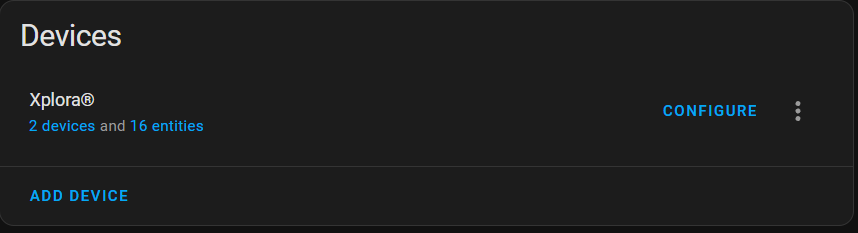
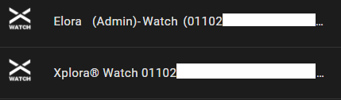
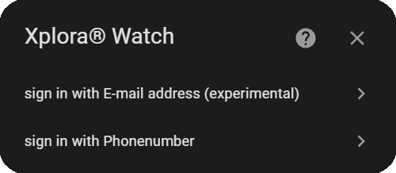
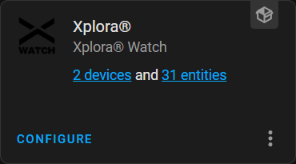
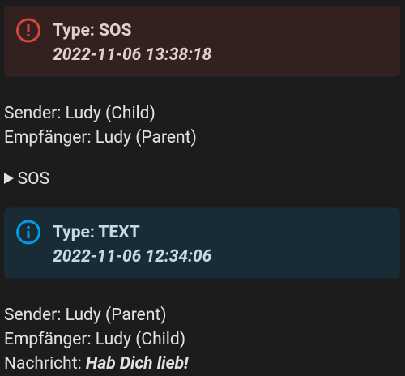
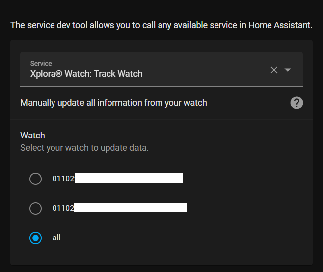
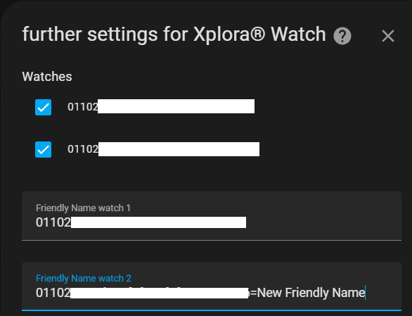
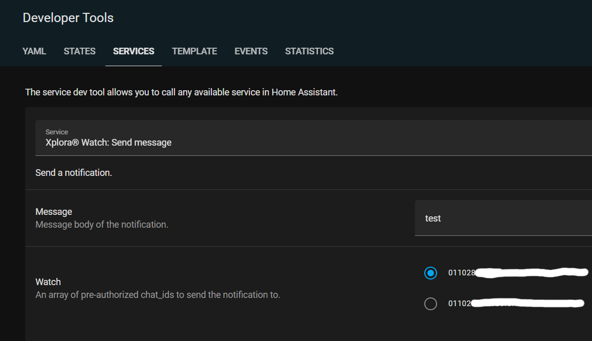

# Xplora® Watch Version 2

Xplora® Watch Version 2 integration for Home Assistant

[](https://my.home-assistant.io/redirect/hacs_repository/?owner=Ludy87&repository=xplora_watch&category=integration)\
[](https://github.com/hacs/integration)
[](https://github.com/Ludy87/xplora_watch/releases)

[](LICENSE)
[](https://github.com/Ludy87/xplora_watch/stargazers)
[](https://github.com/Ludy87/xplora_watch/issues)\
[](https://github.com/psf/black)\
\
[](https://github.com/Ludy87/xplora_watch/actions/workflows/hassfest.yaml)

[](https://www.buymeacoffee.com/ludy87)

[](https://smile.amazon.de/registry/wishlist/2MX8QK8VE9MV1)

---


## 🚨 Important: Upgrading from version 2.8.3 or earlier to version 2.10.\* 🚨

1. ⚠️back up your Homeassistant instance
2. ⚠️save your backup externally
3. Preparation
   - 👥There is more than one Xplora® Watch user logged into the Homeassistant instance
     - 🗑️remove the user that is generating the error `Platform xplora_watch does not generate unique IDs.`
     - 🗑️remove the sensors that are listed as unavailable
     - restart Homeassistant
   - 👤There is only one user for Xplora® Watch who is logged into the Homeassistant instance
     - no further steps necessary
4. Upgrade the integration and restart Homeassistant instance
5. Two instances (or more) of Xplora® Watch are now displayed - click on `2 devices` 
6. an instance with your name at the beginning is the new instance 
   - click on the old instance
   - Go to the pen in the upper right corner
   - disable this device
7. (optional for more than one user)
   - add the second user `ADD DEVICE`
8. Follow-up
   - new entities are created or old ones are listed as unavailable
   - the old entities can be removed
   - note that the new entities have a new naming convention

### Names layout changed (v2.10.0)

_binary\_sensor:_

- `"Watch Name" "Watch" "Charging" "Watch ID"` to `"Watch Name" "Watch" "Charging" "(Username)"`
- `"Watch Name" "Watch" "Safezone" "Watch ID"` to `"Watch Name" "Watch" "Safezone" "(Username)"`
- `"Watch Name" "Watch" "State" "Watch ID"` to `"Watch Name" "Watch" "State" "(Username)"`

_device\_tracker:_

- `"Watch Name" "Watch" "Tracker" "Watch ID"` to `"Watch Name" "Watch" "Tracker" "(Username)"`
- `"Safzone" "Safzone Name" "Watch ID"` to `"Watch Name" "Watch" "Safzone" "Safzone Name" "(Username)"`

_sensor:_

- `"Watch Name" "Watch" "Battery" "Watch ID"` to `"Watch Name" "Watch" "Battery" "(Username)"`
- `"Watch Name" "Watch" "Xcoin" "Watch ID"` to `"Watch Name" "Watch" "Xcoin" "(Username)"`
- `"Watch Name" "Watch" "Step Day" "Watch ID"` to `"Watch Name" "Watch" "Step Day" "(Username)"`
- `"Watch Name" "Watch" "Message" "Watch ID"` to `"Watch Name" "Watch" "Message" "(Username)"`
- `"Watch Name" "Watch" "Distance" "Watch ID"` to `"Watch Name" "Watch" "Distance" "(Username)"`

_switch:_

- `"Watch Name" "Watch" "Alarm" "Time" "Watch ID"` to `"Watch Name" "Watch" "Alarm" "Time" "(Username)"`
- `"Watch Name" "Watch" "Silent" "Time" "Watch ID"` to `"Watch Name" "Watch" "Silent" "Time" "(Username)"`

## Features

- Control your watch from Home Assistant
- Receive notifications from your watch
- Track your watch's location
- View your watch's battery level
- And more!

**IMPORTANCE: Of a service is activated by automation, the sensors will no longer be updated. Therefore, activate the `xplora_watch.see` service with a corresponding interval.**

| Features                                                                                             | Type           |
| ---------------------------------------------------------------------------------------------------- | -------------- |
| Battery                                                                                              | Sensor         |
| Watch-Xcoin                                                                                          | Sensor         |
| Watch Step per Day                                                                                   | Sensor         |
| Watch Online state                                                                                   | Binary Sensor  |
| Watch is in Safezone                                                                                 | Binary Sensor  |
| charging state                                                                                       | Binary Sensor  |
| Watch silent(s)                                                                                      | Switch         |
| Watch alarm(s)                                                                                       | Switch         |
| [Send Message](https://github.com/Ludy87/xplora_watch#send-message)                                  | Notify         |
| [Send Message Service](https://github.com/Ludy87/xplora_watch#send-message-via-service-v203)         | Service        |
| [Read Messages from Account](https://github.com/Ludy87/xplora_watch#read-messages-from-account-v240) | Service        |
| [Delete Messages from App](https://github.com/Ludy87/xplora_watch#delete-messages-from-app-v260)     | Service        |
| [Manually update](https://github.com/Ludy87/xplora_watch#manually-update-v208--v209)                 | Service        |
| Turn off Watch                                                                                       | Service        |
| Watch Tracking                                                                                       | Device Tracker |
| Watch Show Safezone(s)                                                                               | Device Tracker |
---

## Installation

### MANUAL INSTALLATION

Copy the xplora_watch [last Release](https://github.com/Ludy87/xplora_watch/releases) folder and all of its contents into your Home Assistant's custom_components folder. This folder is usually inside your /config folder. If you are running Hass.io, use SAMBA to copy the folder over. If you are running Home Assistant Supervised, the custom_components folder might be located at /usr/share/hassio/homeassistant. You may need to create the custom_components folder and then copy the localtuya folder and all of its contents into it. Alternatively, you can install localtuya through HACS by adding this repository.

### INSTALLATION mit HACS

1. Ensure that [HACS](https://hacs.xyz/) is installed.
2. Search for and install the "**Xplora® Watch Integration**" integration. [](https://github.com/Ludy87/xplora_watch/releases)
3. [Configuration for the "Xplora® Watch Version 2" integration is now performed via a config flow as opposed to yaml configuration file.](https://github.com/Ludy87/xplora_watch#basis-configuration)

---

## Basis Configuration

1. Go to HACS -> Integrations -> Click "+"
2. Search for "Xplora® Watch" repository and add to HACS
3. Restart Home Assistant when it says to.
4. In Home Assistant, go to Configuration -> Integrations -> Click "+ Add Integration"
5. Search for "Xplora® Watch" and follow the instructions to setup.

Xplora® should now appear as a card under the HA Integrations page with "Configure" selection available at the bottom of the card.

| add in Version 2.2.0               | add in Version 2                             |
| ---------------------------------- | -------------------------------------------- |
|  |  |

---

## Downloaded from voice messages, Videos and Images (v2.7.0)

- All voice messages, videos and images are stored in `config/www/{voice|video|image|}`. [#152](https://github.com/Ludy87/xplora_watch/discussions/152)
  - The voice message will be downloaded as amr and converted to mp3.
  - Videos as mp4
  - Images as jpeg
- updated [Markdown Card Sample](https://raw.githubusercontent.com/Ludy87/xplora_watch/main/samples/markdown-card-read-messages.md) [#155](https://github.com/Ludy87/xplora_watch/issues/155)

---

## Delete Messages from App (v2.6.0)

- new service added - delete only app message
- chats: add ```delete_flag```  `1` = message is deleted
- updated [Markdown Card Sample](https://raw.githubusercontent.com/Ludy87/xplora_watch/main/samples/markdown-card-read-messages.md)
- add Emoji
  - M1001 = "😄"
  - M1002 = "😏"
  - M1003 = "😘"
  - M1004 = "😅"
  - M1005 = "😂"
  - M1006 = "😭"
  - M1007 = "😍"
  - M1008 = "😎"
  - M1009 = "😜"
  - M1010 = "😳"
  - M1011 = "🥱"
  - M1012 = "👏"
  - M1013 = "😡"
  - M1014 = "👍"
  - M1015 = "😏"
  - M1016 = "😓"
  - M1017 = "🍧"
  - M1018 = "😮"
  - M1019 = "M1019"
  - M1020 = "🎁"
  - M1021 = "M1021"
  - M1022 = "☺️"
  - M1023 = "M1023"
  - M1024 = "🌹"

---

## Read Messages from Account (v2.4.0)

- A new (message) sensor has been added, default: disabled
- new service added, (message) sensor will be updated
- change Number of Messages option find in "Configure"
- [Markdown Card Sample](https://raw.githubusercontent.com/Ludy87/xplora_watch/main/samples/markdown-card-read-messages.md) (updated v2.6.0)
- [Automation Sample](https://raw.githubusercontent.com/Ludy87/xplora_watch/main/samples/automation-read-messages.yaml)



---

## Multilanguage (v2.1.0)

- DE
- EN

---

## Manually update (v2.0.8 & v2.0.9)

Manually update all information from your watch



---

## Change Friendly Name (v2.0.7)

Set Friendly Name
Please note that this can also change the entry_id!

Rule format: ```watchID=New Name``` Notice the equals sign



---

## Send Message

Set Target with the WatchID for the receiver watch

### require (v2.10.0)

- `message`
- `target`
- `data`
  - `user_id`

```yaml
service: notify.xplora_watch
data:
  message: Message
  data:
    user_id: 053eb6e5e5b32e502cfb1934cefb77ff
  target: 01102f442f1125f525f5f3336316068
```


---

## Send Message via Service (v2.0.3)



---

## [🏳 Supported Countries 🏳](https://github.com/Ludy87/xplora_watch/wiki/Countries)

---

## Debug

```yaml
logger:
  logs:
    custom_components.xplora_watch: debug
```

---

## [Workaround for getting logged out of the Xplora® App on your phone](https://github.com/Ludy87/xplora_watch/issues/24)

---

<!-- START ./CHANGELOG.md -->
## Changelog

### [v2] - 2022-09-18

<!-- END ./CHANGELOG.md -->

<!-- include Ludy87/sponsors/blob/main/README.md -->
