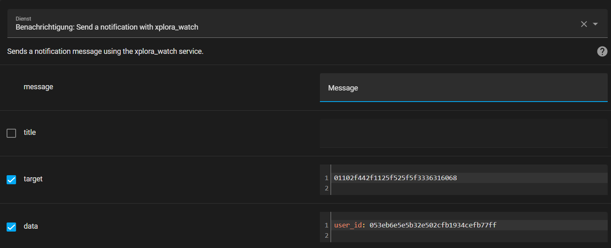

# Xplora® Watch

Home Assistant Sensors for Xplora® Watch

[](https://github.com/hacs/integration)
[](https://github.com/Ludy87/xplora_watch/releases)

[](LICENSE)
[](https://github.com/Ludy87/xplora_watch/issues)
[](https://github.com/psf/black)

[](https://github.com/Ludy87/xplora_watch/actions/workflows/hassfest.yaml)


## Features

Features | Type
---|---
Battery | Sensor
Watch-Xcoin | Sensor
Watch Online state | Binary Sensor
Watch is safe | Binary Sensor
Watch charging | Binary Sensor
Watch silent(s) | Switch
Watch alarm(s) | Switch
Send Message | Notify
Watch Tracking | Device Tracker
Watch Show Safezone | Device Tracker

---
## Installation

### MANUAL INSTALLATION

Copy the xplora_watch [last Releae](https://github.com/Ludy87/xplora_watch/releases) folder and all of its contents into your Home Assistant's custom_components folder. This folder is usually inside your /config folder. If you are running Hass.io, use SAMBA to copy the folder over. If you are running Home Assistant Supervised, the custom_components folder might be located at /usr/share/hassio/homeassistant. You may need to create the custom_components folder and then copy the localtuya folder and all of its contents into it Alternatively, you can install localtuya through HACS by adding this repository.

### INSTALLATION mit HACS

1. Ensure that [HACS](https://hacs.xyz/) is installed.
2. Search for and install the "__Xplora® Watch Integration__" integration. [](https://github.com/Ludy87/xplora_watch/releases)
3. [Add a `xplora_watch` entry to your `configuration.yaml`.](https://github.com/Ludy87/xplora_watch#basis-configuration)
4. Restart Home Assistant.

---
## Basis Configuration

1. Add entry to your `configuration.yaml`

### <u>Small Settings</u>
```yaml
xplora_watch:
  country_code: "+49"
  phonenumber: "123456789"
  password: "password"
  userlang: "de-DE"
  timezone: "Europe/Berlin"
  types:
    - "battery"
    - "xcoin"
    - "state"
    - "safezone"
    - "charging"
    - "silents"
    - "alarms"
    - "dt_watch"
  safezones: "show" # optional
  scan_interval: 180 # default sec - optional
  tracker_scan_interval: 60 # default sec - optional
```
---
### <u>Optional Settings</u>

for [OpenCage Geocoding API](https://opencagedata.com/) address searching
```yaml
  opencage: API_KEY # optional
```
You have more watches and you will one watch integridad? Select this one with ```child_phonenumber``` or ```watch_id```. The safety way is ```child_phonenumber```

```yaml
  child_phonenumber: # optional & ignored if 'watch_id' is set
    - "9876543210"
    - "5678901234"
```
If ```watch_id``` is set, ```child_phonenumber``` is ignored. Errors can occur.
```yaml
  watch_id: # optional
    - 012328123d123f5e775e5e3346739732
```
---
### <u>Full Settings</u>
```yaml
xplora_watch:
  country_code: "+49"
  phonenumber: "123456789"
  password: "password"
  userlang: "de-DE"
  timezone: "Europe/Berlin"
  opencage: API_KEY # optional
  child_phonenumber: # optional & ignored if 'watch_id' is set
    - "9876543210"
    - "5678901234"
  watch_id: # optional
    - 012328123d123f5e775e5e3346739732
  types:
    - "battery"
    - "xcoin"
    - "state"
    - "safezone"
    - "charging"
    - "silents"
    - "alarms"
    - "dt_watch"
  safezones: "show" # optional
  scan_interval: 180 # default sec - optional
  tracker_scan_interval: 60 # default sec - optional
```
2. Restart Home Assistant
3. Check `Home Assistant » Developer Tools » States`

---
## Notify configuration

1. Add entry Notification to your `configuration.yaml`
```yaml
notify:
  - platform: xplora_watch
    name: "XPlora"
```
2. Restart Home Assistant
3. Check `Home Assistant » Developer Tools » States`



---
## Tracking Setting

1. define if wrong status (`not_home`|`home`)
```yaml
zone:
  - name: Home
    latitude: '' # your lat
    longitude: '' # your lng
```
---
## Special functions

### <u>1. disable your tracking with one toggle, without restart of Home Assistant</u>
- **add helper toggle with Name `Xplora Tracker Switch` Entity-ID `input_boolean.xplora_tracker_switch`**
- toggle switch Device Track [#15](https://github.com/Ludy87/xplora_watch/issues/15)

### <u>2. Track your watch with one toggle</u>
- **add helper toggle with Name `Xplora Tracker Now` Entity-ID `input_boolean.xplora_track_now`**
- don't forget this one to disable, your watch track every 10 seconds
---
## 🏳 Supported Countries 🏳 [add Country Code](https://github.com/Ludy87/xplora_watch/issues/new?assignees=Ludy87&labels=A%3A+Country+Code&template=add_country.yml&title=%5B%F0%9F%8F%B3+add+Country+Code%5D+%28Country+summary%29)

<!-- START ./countries.md -->
| country name | country code |
|--------------|--------------|
| Afghanistan | 93 |
| Albania | 355 |
| Algeria | 213 |
| AmericanSamoa | 1 684 |
| Andorra | 376 |
| Angola | 244 |
| Anguilla | 1 264 |
| Antarctica | 672 |
| Antigua and Barbuda | 1268 |
| Argentina | 54 |
| Armenia | 374 |
| Aruba | 297 |
| Australia | 61 |
| Austria | 43 |
| Azerbaijan | 994 |
| Bahamas | 1 242 |
| Bahrain | 973 |
| Bangladesh | 880 |
| Barbados | 1 246 |
| Belarus | 375 |
| Belgium | 32 |
| Belize | 501 |
| Benin | 229 |
| Bermuda | 1 441 |
| Bhutan | 975 |
| Bolivia, Plurinational State of | 591 |
| Bosnia and Herzegovina | 387 |
| Botswana | 267 |
| Brazil | 55 |
| British Indian Ocean Territory | 246 |
| Brunei Darussalam | 673 |
| Bulgaria | 359 |
| Burkina Faso | 226 |
| Burundi | 257 |
| Cambodia | 855 |
| Cameroon | 237 |
| Canada | 1 |
| Cape Verde | 238 |
| Cayman Islands |  345 |
| Central African Republic | 236 |
| Chad | 235 |
| Chile | 56 |
| China | 86 |
| Christmas Island | 61 |
| Cocos (Keeling) Islands | 61 |
| Colombia | 57 |
| Comoros | 269 |
| Congo | 242 |
| Congo, The Democratic Republic of the | 243 |
| Cook Islands | 682 |
| Costa Rica | 506 |
| Cote d'Ivoire | 225 |
| Croatia | 385 |
| Cuba | 53 |
| Cyprus | 357 |
| Czech Republic | 420 |
| Denmark | 45 |
| Djibouti | 253 |
| Dominica | 1 767 |
| Dominican Republic | 1 849 |
| Ecuador | 593 |
| Egypt | 20 |
| El Salvador | 503 |
| Equatorial Guinea | 240 |
| Eritrea | 291 |
| Estonia | 372 |
| Ethiopia | 251 |
| Falkland Islands (Malvinas) | 500 |
| Faroe Islands | 298 |
| Fiji | 679 |
| Finland | 358 |
| France | 33 |
| French Guiana | 594 |
| French Polynesia | 689 |
| Gabon | 241 |
| Gambia | 220 |
| Georgia | 995 |
| Germany | 49 |
| Ghana | 233 |
| Gibraltar | 350 |
| Greece | 30 |
| Greenland | 299 |
| Grenada | 1 473 |
| Guadeloupe | 590 |
| Guam | 1 671 |
| Guatemala | 502 |
| Guernsey | 44 |
| Guinea | 224 |
| Guinea-Bissau | 245 |
| Guyana | 595 |
| Haiti | 509 |
| Holy See (Vatican City State) | 379 |
| Honduras | 504 |
| Hong Kong | 852 |
| Hungary | 36 |
| Iceland | 354 |
| India | 91 |
| Indonesia | 62 |
| Iran, Islamic Republic of | 98 |
| Iraq | 964 |
| Ireland | 353 |
| Isle of Man | 44 |
| Israel | 972 |
| Italy | 39 |
| Jamaica | 1 876 |
| Japan | 81 |
| Jersey | 44 |
| Jordan | 962 |
| Kazakhstan | 7 7 |
| Kenya | 254 |
| Kiribati | 686 |
| Korea, Democratic People's Republic of | 850 |
| Korea, Republic of | 82 |
| Kuwait | 965 |
| Kosovo | 383 |
| Kyrgyzstan | 996 |
| Lao People's Democratic Republic | 856 |
| Latvia | 371 |
| Lebanon | 961 |
| Lesotho | 266 |
| Liberia | 231 |
| Libyan Arab Jamahiriya | 218 |
| Liechtenstein | 423 |
| Lithuania | 370 |
| Luxembourg | 352 |
| Macao | 853 |
| Macedonia, The Former Yugoslav Republic of | 389 |
| Madagascar | 261 |
| Malawi | 265 |
| Malaysia | 60 |
| Maldives | 960 |
| Mali | 223 |
| Malta | 356 |
| Marshall Islands | 692 |
| Martinique | 596 |
| Mauritania | 222 |
| Mauritius | 230 |
| Mayotte | 262 |
| Mexico | 52 |
| Micronesia, Federated States of | 691 |
| Moldova, Republic of | 373 |
| Monaco | 377 |
| Mongolia | 976 |
| Montenegro | 382 |
| Montserrat | 1664 |
| Morocco | 212 |
| Mozambique | 258 |
| Myanmar | 95 |
| Namibia | 264 |
| Nauru | 674 |
| Nepal | 977 |
| Netherlands | 31 |
| Netherlands Antilles | 599 |
| New Caledonia | 687 |
| New Zealand | 64 |
| Nicaragua | 505 |
| Niger | 227 |
| Nigeria | 234 |
| Niue | 683 |
| Norfolk Island | 672 |
| Northern Mariana Islands | 1 670 |
| Norway | 47 |
| Oman | 968 |
| Pakistan | 92 |
| Palau | 680 |
| Palestinian Territory, Occupied | 970 |
| Panama | 507 |
| Papua New Guinea | 675 |
| Paraguay | 595 |
| Peru | 51 |
| Philippines | 63 |
| Pitcairn | 872 |
| Poland | 48 |
| Portugal | 351 |
| Puerto Rico | 1 939 |
| Qatar | 974 |
| Romania | 40 |
| Russia | 7 |
| Rwanda | 250 |
| Réunion | 262 |
| Saint Barthélemy | 590 |
| Saint Helena, Ascension and Tristan Da Cunha | 290 |
| Saint Kitts and Nevis | 1 869 |
| Saint Lucia | 1 758 |
| Saint Martin | 590 |
| Saint Pierre and Miquelon | 508 |
| Saint Vincent and the Grenadines | 1 784 |
| Samoa | 685 |
| San Marino | 378 |
| Sao Tome and Principe | 239 |
| Saudi Arabia | 966 |
| Senegal | 221 |
| Serbia | 381 |
| Seychelles | 248 |
| Sierra Leone | 232 |
| Singapore | 65 |
| Slovakia | 421 |
| Slovenia | 386 |
| Solomon Islands | 677 |
| Somalia | 252 |
| South Africa | 27 |
| South Georgia and the South Sandwich Islands | 500 |
| Spain | 34 |
| Sri Lanka | 94 |
| Sudan | 249 |
| Suriname | 597 |
| Svalbard and Jan Mayen | 47 |
| Swaziland | 268 |
| Sweden | 46 |
| Switzerland | 41 |
| Syrian Arab Republic | 963 |
| Taiwan, Province of China | 886 |
| Tajikistan | 992 |
| Tanzania, United Republic of | 255 |
| Thailand | 66 |
| Timor-Leste | 670 |
| Togo | 228 |
| Tokelau | 690 |
| Tonga | 676 |
| Trinidad and Tobago | 1 868 |
| Tunisia | 216 |
| Turkey | 90 |
| Turkmenistan | 993 |
| Turks and Caicos Islands | 1 649 |
| Tuvalu | 688 |
| Uganda | 256 |
| Ukraine | 380 |
| United Arab Emirates | 971 |
| United Kingdom | 44 |
| United States | 1 |
| Uruguay | 598 |
| Uzbekistan | 998 |
| Vanuatu | 678 |
| Venezuela, Bolivarian Republic of | 58 |
| Viet Nam | 84 |
| Virgin Islands, British | 1284 |
| Virgin Islands, U.S. | 1340 |
| Wallis and Futuna | 681 |
| Yemen | 967 |
| Zambia | 260 |
| Zimbabwe | 263 |
| Åland Islands | 358 |

<!-- END ./countries.md -->

---
# Debug

```yaml
logger:
  logs:
    custom_components.xplora_watch: debug
```

---
# Workaround for logout in the Xplora® App

1. add phone number from watch to contacts (as admin)
2. create a login profile for this phone number
3. log into the app with the created profile to test whether it works
4. use the login data for the integration

---
## [Changelog](https://github.com/Ludy87/xplora_watch/blob/main/CHANGELOG.md)

<!-- START ./CHANGELOG.md -->
# Change Log

## [v1.0.36] - 2022-05-15

### Fixed
- 🐛 Fix #35
### Changed
- 🌱 bump pyxplora_api to 2.0.90
- 🗑️ clean up

---
## [v1.0.35] - 2022-05-07

<details>

### Fixed
- 🐛 Fix keyerror
### Changed
- 🌱 homeassistant 2022.5.2
- 🗑️ clean up
</details>

---
## [v1.0.34] - 2022-05-03

<details>

### Fixed
- 🐛 Fix sendText Bug
</details>

---
## [v1.0.33] - 2022-05-01

<details>

### Added
- 🏗️ resolved [#29](https://github.com/Ludy87/xplora_watch/issues/29) tracking device
</details>

---
## [v1.0.31 + v1.0.32] - 2022-04-30

<details>

### Fixed
- 🐛 Fix empty address

### Changed
- 🌱 homeassistant 2022.4.7

### Added
- 🏷️ add types
</details>

---
## [v1.0.30] - 2022-04-17

<details>

### Changed
- 🎨 Black Code Formatter
</details>

---
## [v0.0.29] - 2022-04-10

<details>

### Changed
- 🏷️ type `lat` and `lng` | `<str>` to `<float>`
- remove `*_async` (new Lib version)
- remove `await` without async function
- rename `ids` to `watch_ids`
- renmae `id` to `watch_id`
</details>

---
## [v0.0.28] - 2022-04-02

<details>

### Fixed
- 🎨 better error detection
</details>

---
## [v0.0.27] - 2022-03-26

<details>

### Fixed
- OpenCage: Server disconnected
</details>

---
## [v0.0.26] - 2022-03-20

<details>

### Changed
- API-Lib
</details>

---
## [v0.0.25] - 2022-03-19

<details>

### Added
- OpenCage Geocoding API

### Fixed
- #11

### Changed
- `child_no` to `watch_ids`
</details>

---
## [v0.0.24] - 2022-03-15

<details>

### Changed
- var name
- Api-Lib-Version
- obsolet import removed
</details>

---
## [v0.0.23] - 2022-03-11

<details>

### Added
- Lint with flake8

### Changed
- Entities
- Api-Lib-Version
- obsolet import removed
</details>

---
## [v0.0.22] - 2022-02-28

<details>

### Changed
- distance calculation (Meter)
</details>

---
## [v0.0.21] - 2022-02-27

<details>

### Changed
- var name

### Added
- Device Track last Time
- toggle switch Device Track [#15](https://github.com/Ludy87/xplora_watch/issues/15)

**Please add helper toggle with Name `Xplora Tracker Switch` Entity-ID `input_boolean.xplora_tracker_switch`**
</details>

---
## [v0.0.20] - 2022-02-17

<details>

### Changed
- Api-Lib-Version
</details>

---
## [v0.0.18 + v0.0.19] - 2022-02-14

<details>

### Fixed
- Device Tracker state `not_home` | `home` #12

### Changed
- obsolet import removed
</details>

---
## [v0.0.17] - 2022-02-11

<details>

### Fixed
- state error
- two init notify
- device tracker init error - no def

### Changed
- var name api -> controller
- obsolet import removed
</details>

---
## [v0.0.15-Beta + v0.0.16-Beta] - 2022-02-09

<details>

### Fixed
- Notify send error

### Changed
- hacs & homeassistant version

### Added
- multi watch profil
</details>

---
## [v0.0.14] - 2022-01-23

<details>

### Changed
- cleanup

### Added
- Icon Silent/Alarm
</details>

---
## [v0.0.13] - 2022-01-21

<details>

### Changed
- cleanup

### Fixed
- frozen state
</details>

---
## [v0.0.12] - 2022-01-20

<details>

### Added
- Watch Tracker Name
</details>

---
## [v0.0.11] - 2022-01-19

<details>

### Added
- Watch Safezone GPS - `DeviceTracker`
- Profil image Watch Tracker

### Changed
- variable
</details>

---
## [v0.0.10] - 2022-01-18

<details>

### Added
- Track Watch - `DeviceTracker`
</details>

---
## [v0.0.9] - 2022-01-08

<details>

### Added
- Watch alarm(s) - `Switch`
</details>

---

## [v0.0.8] - 2022-01-08

<details>

### Fixed
- frozen state
</details>

---
## [v0.0.7] - 2022-01-06

<details>

### Added
- Watch is safe - `BinarySensor`
- Watch charging - `BinarySensor`
- Watch silent(s) - `Switch`

### Changed
- `sync` to `async`

### Fixed
- timer control reload Entity
- wrong declaration (`sensors` to `types`)
</details>

<!-- END ./CHANGELOG.md -->
