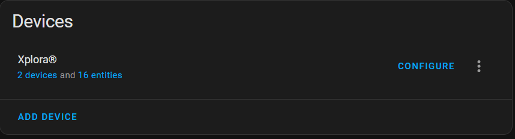
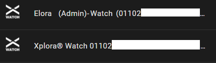

# Xplora® Watch Version 2

Xplora® Watch Version 2 integration for Home Assistant

\

\
\
\

## 🚨 Important: Upgrading from version 2.8.3 or earlier to version 2.10.\* 🚨

1. ⚠️back up your Homeassistant instance
2. ⚠️save your backup externally
3. Preparation
   - 👥There is more than one Xplora® Watch user logged into the Homeassistant instance
     - 🗑️remove the user that is generating the error `Platform xplora_watch does not generate unique IDs.`
     - 🗑️remove the sensors that are listed as unavailable
     - restart Homeassistant
   - 👤There is only one user for Xplora® Watch who is logged into the Homeassistant instance
     - no further steps necessary
4. Upgrade the integration and restart Homeassistant instance
5. Two instances (or more) of Xplora® Watch are now displayed - click on `2 devices` 
6. an instance with your name at the beginning is the new instance 
   - click on the old instance
   - Go to the pen in the upper right corner
   - disable this device
7. (optional for more than one user)
   - add the second user `ADD DEVICE`
8. Follow-up
   - new entities are created or old ones are listed as unavailable
   - the old entities can be removed
   - note that the new entities have a new naming convention

### Names layout changed (v2.10.0)

_binary\_sensor:_

- `"Watch Name" "Watch" "Charging" "Watch ID"` to `"Watch Name" "Watch" "Charging" "(Username)"`
- `"Watch Name" "Watch" "Safezone" "Watch ID"` to `"Watch Name" "Watch" "Safezone" "(Username)"`
- `"Watch Name" "Watch" "State" "Watch ID"` to `"Watch Name" "Watch" "State" "(Username)"`

_device\_tracker:_

- `"Watch Name" "Watch" "Tracker" "Watch ID"` to `"Watch Name" "Watch" "Tracker" "(Username)"`
- `"Safzone" "Safzone Name" "Watch ID"` to `"Watch Name" "Watch" "Safzone" "Safzone Name" "(Username)"`

_sensor:_

- `"Watch Name" "Watch" "Battery" "Watch ID"` to `"Watch Name" "Watch" "Battery" "(Username)"`
- `"Watch Name" "Watch" "Xcoin" "Watch ID"` to `"Watch Name" "Watch" "Xcoin" "(Username)"`
- `"Watch Name" "Watch" "Step Day" "Watch ID"` to `"Watch Name" "Watch" "Step Day" "(Username)"`
- `"Watch Name" "Watch" "Message" "Watch ID"` to `"Watch Name" "Watch" "Message" "(Username)"`
- `"Watch Name" "Watch" "Distance" "Watch ID"` to `"Watch Name" "Watch" "Distance" "(Username)"`

_switch:_

- `"Watch Name" "Watch" "Alarm" "Time" "Watch ID"` to `"Watch Name" "Watch" "Alarm" "Time" "(Username)"`
- `"Watch Name" "Watch" "Silent" "Time" "Watch ID"` to `"Watch Name" "Watch" "Silent" "Time" "(Username)"`

## Features

| Features                   | Type           |
| -------------------------- | -------------- |
| Battery                    | Sensor         |
| Watch-Xcoin                | Sensor         |
| Watch Step per Day         | Sensor         |
| Watch Online state         | Binary Sensor  |
| Watch is in Safezone       | Binary Sensor  |
| charging state             | Binary Sensor  |
| Watch silent(s)            | Switch         |
| Watch alarm(s)             | Switch         |
| Send Message               | Notify         |
| Send Message               | Service        |
| Read Messages from Account | Service        |
| Delete Messages from App   | Service        |
| Manually update            | Service        |
| Turn off Watch             | Service        |
| Watch Tracking             | Device Tracker |
| Watch Show Safezone(s)     | Device Tracker |
---

## Basis Configuration

Configuration for the "Xplora® Watch Version 2" integration is now performed via a config flow as opposed to yaml configuration file.

1. Go to HACS -> Integrations -> Click "+"
2. Search for "Xplora® Watch" repository and add to HACS
3. Restart Home Assistant when it says to.
4. In Home Assistant, go to Configuration -> Integrations -> Click "+ Add Integration"
5. Search for "Xplora® Watch" and follow the instructions to setup.

---

## [Changelog](https://github.com/Ludy87/xplora_watch/blob/main/CHANGELOG.md)
